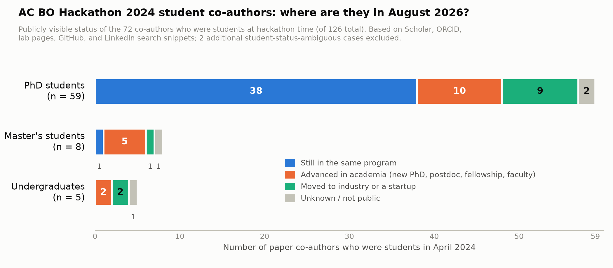

# Before vs. after: participant trajectories of the 2024 AC BO Hackathon cohort

Prepared 2026-08-19 for issue #172 (companion to the follow-on work search). This report asks a deliberately speculative question posed by the organizers: did the hackathon give participants, especially students, exposure or experience that plausibly helped them continue in this field or compete for opportunities (grad programs, postdocs, faculty posts, jobs, internships)?

**Read this first.** Everything below is assembled from publicly visible professional information (Google Scholar, ORCID, university and lab pages, personal websites, GitHub, LinkedIn snippets surfaced in search results, and an Edison Scientific literature scan). It is observational: these people self-selected into a BO hackathon and into paper authorship, the field itself grew rapidly over the same two years, and none of the outcomes below can be causally attributed to the event. What the data can show is (a) whether the cohort stayed in the field, (b) whether hackathon projects visibly fed later work, and (c) whether participants themselves treat the hackathon as a credential. On all three, the answer is yes more often than a two-day virtual event would suggest.

## The cohort at hackathon time (April 2024)

- 139 unique registrants (150 project sign-ups across 45 projects): 115 academia (83 percent), 21 industry (15 percent), 3 government (2 percent).
- 126 co-authors on the community paper (ChemRxiv, doi 10.26434/chemrxiv-2025-dzh5z); this report tracks that cohort because authorship is a public opt-in.
- Career stage of the 126 in April 2024, from the per-person research: 59 PhD students, 8 master's students, 5 undergraduates (74 students, 59 percent of the cohort, plus 2 student-status-ambiguous cases), 23 postdocs or university research staff, 16 industry, 5 faculty, 3 government lab, 1 nonprofit institute, 6 unknown.

## Headline numbers (August 2026)

| Signal | Count | Share |
|---|---|---|
| Co-authors with at least one post-April-2024 publicly visible output in or adjacent to BO, active learning, or self-driving labs | 96 of 126 | 76 percent |
| Students (at hackathon time) with such output | 57 of 74 | 77 percent |
| Co-authors with a visible role or affiliation change since the hackathon | 62 of 126 | 49 percent |
| Co-authors with an explicit public mention of the hackathon (CV, personal site, repo, post, acknowledgment) | 19 of 126 | 15 percent |
| Hackathon projects with a visible continuation trail (paper, tool, thesis chapter, or maintained benchmark by the same people) | about 19 of 45 | about 42 percent |
| New faculty or group-leader appointments in the cohort since the event | 9 | |

Per-person records with evidence URLs and confidence ratings: `trajectories.json`. Coverage is honest about its limits: 88 records are high confidence, 32 medium, 6 low (mostly common names or thin public trails).

## The student picture

Of the 72 students with a clean stage classification (2 ambiguous cases excluded: Andrew Wang, whose current role is not public, and Jakob Zeitler, who was simultaneously finishing a UCL PhD and running Matterhorn Studio):

- **PhD students (59):** 38 are still in their programs, many with new fellowships or internships along the way (Amazon Fellowship for Yanqiao Zhu, Bloomberg Fellowship for Matias Altamirano, NSF GRF for Quinn Gallagher, internships at Apple/Amazon/ByteDance for Kehan Guo, AWS for Taicheng Guo, Nvidia Research for Yunheng Zou, Etcembly for Yuxin Shen). 10 finished and advanced in academia, including one straight to faculty (Yeonghun Kang, KAIST to Assistant Professor at Sungkyunkwan University by January 2026). 9 finished and went to industry or startups (Elton Pan to Lila Sciences, Ting-Yeh Chen to Johnson and Johnson, Anthony Onwuli to MatNex, Bozhao Nan to Eli Lilly, Yifeng Tang to 3M, Alexander Wieczorek to Sensirion, Ayodeji Ijishakin co-founded YC-backed Mecha Health, Andres Bran to b12 Labs, Gbetondji Dovonon to Matterhorn Studio). 2 unknown.
- **Master's students (8):** 5 advanced (Clara Tamura to a Cambridge PhD in a self-driving-lab group, Duc Nguyen to an NUS PhD after his hackathon project became a paper, Luis Walter to a Heidelberg PhD where he first-authored a multi-level BO paper, Magdalena Lederbauer to an MIT PhD via a startup stint, Mohammad Haddadnia to a Dana-Farber/Harvard research role after first-authoring BoTier). 1 still in a program, 1 to industry (Anna Borisova to Recursion), 1 unknown.
- **Undergraduates (5):** 2 started PhDs (Samantha Corapi and Yunheng Zou, both at the University of Toronto; Zou went on to first-author El Agente in Matter, which has over 100 citations, and Corapi is a co-author on the published version of her hackathon project). 2 went to industry-facing roles (Rim Rihana at Merck KGaA, Ratish Panda to AI/ML engineering after a Google Summer of Code on a Bayesian library). 1 unknown.

The single clearest hackathon-to-opportunity story in the cohort: **Gbetondji Dovonon**, a UCL PhD student who joined Matterhorn Studio's multi-fidelity BO team at the hackathon (project 2) and is now listed as a Research Scientist on Matterhorn Studio's team page. The startup he teamed with at the event later hired him.

## Hackathon projects that visibly became something

These are cases where the same people carried the hackathon project topic into a citable output. The strongest pipelines:

| Project | What it became | People |
|---|---|---|
| P44 RBBO | Ranking over Regression for BO and Molecule Selection, APL Machine Learning 2025; the paper acknowledges the hackathon by name | Gary Tom, Stanley Lo, Samantha Corapi |
| P45 BO for Generality | CurryBO (arXiv:2502.18966) and BoTier (Digital Discovery 2025) plus the botier package | Stefan Schmid, Ella Rajaonson, Mohammad Haddadnia, Felix Strieth-Kalthoff, Shi Xuan Leong, Yeonghun Kang |
| P24 ScattBO | Maintained in silico SDL benchmark with public scoreboard; fed into autonomous nanoparticle synthesis (arXiv 2025, ACS Nano 2026) | Andy S. Anker |
| P36 Nonmyopic BO | LookaHES, ICLR 2025 Agentic AI for Science workshop (arXiv:2601.06505) | Duc Nguyen, Sang Truong |
| P15 Adaptive batch sizes | Cost-informed Bayesian reaction optimization, Digital Discovery 2024 | Ruben Laplaza and teammates |
| P21 MolDAIS benchmark | MolDAIS journal paper (Digital Discovery 2025) and generative MOBO (I&ECR 2025/2026) | Farshud Sorourifar, Madhav Muthyala |
| P30/P31 Voltammetry BO | Machine-learning-guided design of electroanalytical pulse waveforms, Digital Discovery 2025, plus SeroOpt software | Cameron Movassaghi |
| P33 Co-heritability search | BO for Crop Genetics with Scalable Probabilistic Models, PMLR 2024 | Ruhana Azam, Sang Truong |
| P8 Molecular representations | ACBO-Feat repo continued; CCBO (Digital Discovery 2025) and active learning papers | Fanjin Wang |
| P2 Multi-fidelity BO | Applying Multi-Fidelity BO in Chemistry: Open Challenges (arXiv 2024) | Mohammed Azzouzi and Matterhorn collaborators |
| P41 RAMBO (LLM-informed BO) | GOLLuM / LLMs as uncertainty-calibrated optimizers (arXiv 2025), reuniting three hackathon participants | Bojana Rankovic, Ryan-Rhys Griffiths, Philippe Schwaller |
| P26/P7 BayBE projects | BayBE paper (Digital Discovery 2025); the team won Digital Discovery's Outstanding Early Career Research Award 2025 | Merck KGaA team and collaborators |
| P27 Warm-up data | BO for Biochemical Discovery with LLMs (ChemRxiv 2025) by the same MIT team | Jurgis Ruza, Elton Pan |
| P37 Metric timing | EmbeddedKnowledgeBO repo extending the question; PhD thesis on intelligent automation | Thomas Andrews |
| P6 EM shielding | JaxLayerLumos (JOSS 2025) by the same three-person team; Multi-BOWS line continued | Jungtaek Kim, Mingxuan Li, Paul Leu |
| P7 Corrosion inhibitors | TU Delft dissertation (2026) and Progress in Materials Science review by the same people | Can Ozkan, Tim Wuerger |

## Participants who publicly treat the hackathon as a credential

Direct evidence that the event carries resume value for at least some participants:

- Mehrad Ansari's CV lists "2nd Place Winner. Bayesian Optimization Hackathon for Chemistry and Materials" (mehradans92.github.io/img/resume.pdf).
- Ruijie (Ray) Zhu's personal site lists placing 6th and the Thompson-sampling result from his team's project (ruijiezhu.us).
- Alexander Wieczorek's LinkedIn appears to cite placing 3rd of 45 teams (search-snippet evidence; behind the login wall).
- Nikhil Thota's personal site lists "Team lead in Bayesian Optimization Hackathon for Chemistry and Materials" as an experience entry.
- Quinn Gallagher's public bio mentions participating in the hackathon hosted by the Acceleration Consortium and Merck KGaA.
- Christina Schenk's personal site lists the hackathon and the resulting paper.
- Shi Xuan Leong's new NTU group site lists the community paper among her publications.
- The RBBO paper's acknowledgments credit the hackathon; the MQS-linked Quantum Innovation Challenge thanks the organizing team; the Kalinin group's microscopy ML hackathon README credits the event as a template.
- A dozen participants keep public hackathon repos or posted their submissions on LinkedIn or X (see `hackathon_mentions.json`).

## The ecosystem effect

Two years on, a noticeable number of the cohort work at organizations whose core business is BO, autonomous experimentation, or AI for science: Lila Sciences (Mehrad Ansari, Elton Pan), FutureHouse (Geemi Wellawatte, Ryan-Rhys Griffiths), Matterhorn Studio (Jakob Zeitler, Gbetondji Dovonon), Atinary Technologies (Mohammed Azzouzi), Radical AI (Curtis Chong), MatNex (Anthony Onwuli), Isomorphic Labs (Joscha Hoche), b12 Labs (Andres Bran), Abstrax Tech (Qianxiang Ai), plus the Acceleration Consortium's own SDL staff (Pablo-Garcia, Melville, Gupta, Yakavets, Zhao, Mueller). Nine cohort members took faculty or group-leader posts since the event (Anker, Astudillo, Baird, Kang, Kim, Laplaza, Leong, Sharma Priyadarshini, Shi). The BayBE team's Digital Discovery award and the repeated overlap with the LLM Hackathon community papers (at least 10 shared participants) point to a durable cross-event community rather than a one-off crowd.

## What this does and does not show

It does show that the cohort overwhelmingly stayed in and advanced within the BO/SDL/AI-for-science space, that a substantial minority of projects became citable outputs, and that some participants explicitly use the event as a credential (prize placements on CVs, team-lead entries on personal sites).

It does not show causation. Most of these people were already on this trajectory; the hackathon is one node in it. The realistic claim for the manuscript or future retrospectives: the hackathon functioned as a working session and networking surface for a community that then kept producing, with at least 19 of 45 projects leaving a visible trail and with concrete cases (Dovonon's hire, the CurryBO/BoTier/RBBO/LookaHES/CIBO papers, prize lines on CVs) where the event demonstrably fed a later opportunity or output. A short alumni survey (as Referee 2's question implies) remains the only way to measure perceived impact directly; this dataset would give such a survey a strong sampling frame and prior.

## Files

- `roster_2024.csv`: 171 unique people merged from paper authors, project pages, and registration data (org and sector only; no contact details).
- `trajectories.json`: 126 per-person before/after records with evidence URLs and confidence ratings.
- `hackathon_mentions.json`: verified external mentions of the hackathon (and checked negatives).
- `edison_trajectory_answer.md`: Edison Scientific LITERATURE_HIGH answer (task 3ca67d53-d51b-4966-b792-39f28bd478c5) on post-hackathon publications and affiliation transitions.
- `student_before_after.png`: summary figure for the 72 cleanly classified students.
- `_task_id.json`: Edison task id for reproducibility.
